<!--new_lines: 3-->
<!--no_footer-->


<!--alignment: center-->

---

_Rust Bangalore Meetup_

**ComChan**: A Terminal-first serial monitor in Rust

<!--new_lines: 2-->

`@Vaishnav-Sabari-Girish`  |  `vaishnav.is-a.dev`

<!--end_slide-->

What is ComChan
---

1. Terminal-first serial monitor written in Rust.
2. Designed for Embedded Engineers who love the terminal more than the Arduino IDE or VSCode (PlatformIO).
3. Logging, Plotting, Replay, Telemetry (3D) and dual view.
4. Works with UART, RTT, `defmt` and BLE.


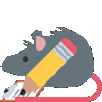

<!--end_slide--> 

The Basic Embedded Development Loop
---

<!--column_layout: [1, 1]-->
<!--column: 0-->

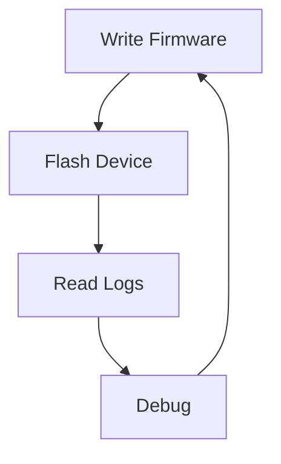

<!--column: 1-->
<!--jump_to_middle-->

This loop happens 100's of times

<!--end_slide-->

The Problem
---

<!--column_layout: [1, 1]-->
<!--column: 0-->

## Existing Tools 

1. Arduino Serial Monitor (Bundled with the Arduino IDE)
2. PuTTY
3. `minicom` / `picocom`
4. Serial Plotter GUI's

<!--new_lines: 1-->

## Common Problems

1. Too many windows (pun intended)
2. Poor Binary Support (Most of the GUI apps are developed for Windows)
3. Limited features (Mostly only Serial console)
4. Have to switch windows to see the output.

<!--column: 1-->

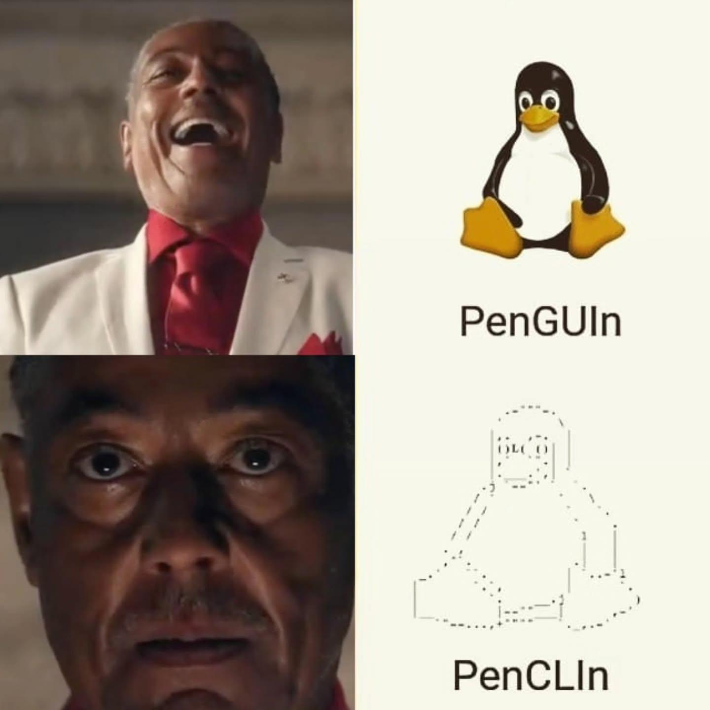

<!--end_slide-->

Why I built ComChan
---

## Design Goals

1. Terminal-first
2. Fast
3. Reliable
4. Config-file based workflow

<!--new_lines: 1-->

> [!IMPORTANT]
> Build a serial monitor that I can actually use.

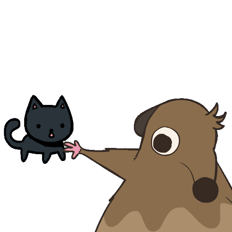 

<!--end_slide-->

High-Level Architecture
---

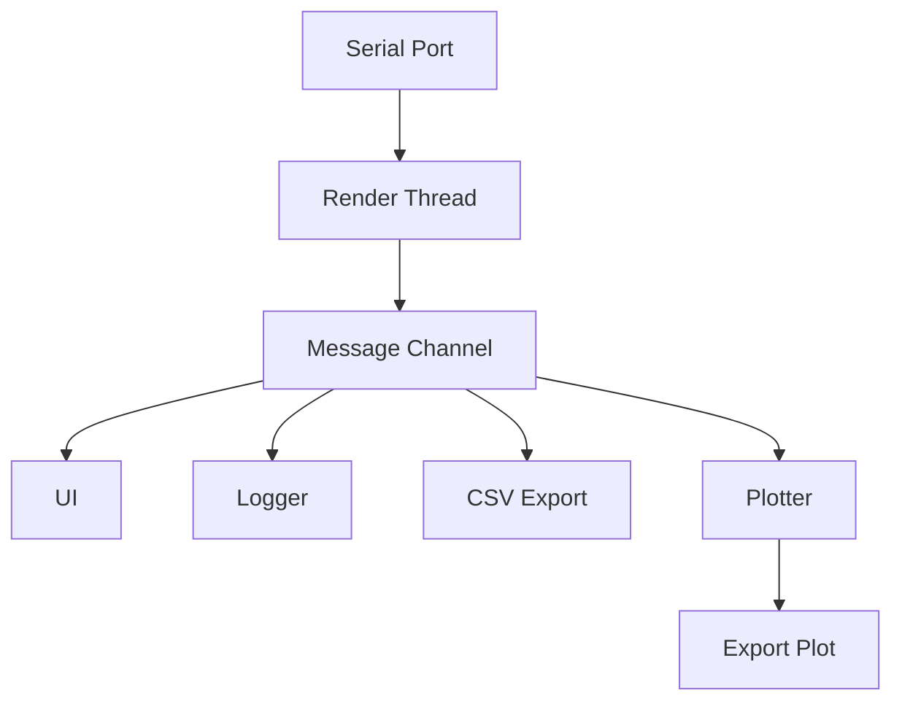

<!--end_slide-->

Why Rust ?
---

1. Memory Safety
2. Concurrency is easy
3. Excellent libraries for creating CLI (`clap`, `clap_complete`) and TUI (`ratatui`) applications.

## Major Crates
```text
serialport          (Serial Port functions)
mpsc                (For Concurrency)
ratatui             (TUI)
clap                (CLI)
crossterm           (Backend)
plotters            (SVG Export)
ratatui_ratty       (For 3D Telemetry)
ratatui_wireframe   (Custom crate for 3D wireframes)
```

## Goals 

<!--column_layout: [1, 1]-->
<!--column: 0-->
- High Throughput
- Low Latency

<!--column: 1-->
- No UI freeze

<!--end_slide-->

Concurrency Model
---

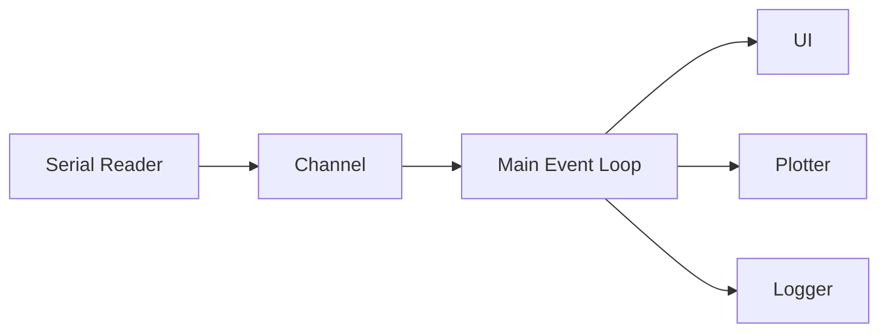

<!--end_slide-->

How I improved performance in some aspects
---

<!--alignment: center-->
<!--new_lines: 3-->

| Problems | Solution |
| ---------- | ------------ |
| Large Logs | Ring Buffers |
|            |              |
| Excess allocations and cloning | `Cow<str>` |
|            |              |
| Slow redraws | Incremental Rendering |
|            |              |
| Blocking operations | Worker Threads |


<!--end_slide-->

Building the Terminal Experience
---

<!--column_layout: [1, 1]-->
<!--column: 0-->
<!--new_lines: 5-->

- **`ratatui`**: Responsive, dynamic layouts and plots
- **Data Views**: `pretty_hex` (Hex view)
- **3D Wireframes**: `ratatui_wireframe` (Custom crate)
- **3D objects**: `ratatui_ratty` crate with the `ratty` terminal.
- **Zephyr shell**: Native `CTRL+L` support and UART shell support

<!--column: 1-->
<!--alignment: center-->


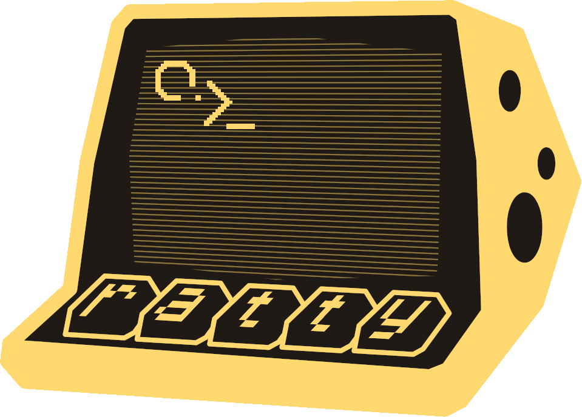

<!--end_slide-->

Power Users and Productivity
---

<!--column_layout: [1, 1]-->
<!--column: 0-->
## Configuration and control

- **TOML-Based config**: Setup once, run anywhere. Can also be added to dotfiles for a reproducible setup.
- **Recovery**: Restarts the session even if the hardware is disconnected and re-connected.
- **Session Replay**: Replay previous sessions with the exact timing using `.log` or `.csv` files of the previous session.

<!--column: 1-->

## Data Export

- **Live streaming**: Dump data into `.log` and `.csv` files.
- **SVG Export**: Export the plot to SVG.

<!--end_slide-->

Developer Experience (DX)
---

<!--column_layout: [3, 2]-->
<!--column: 0-->

## Smoothing the edges

- **Completions**: Provides shell completions for all major shells (`bash`, `zsh`, `fish`, `elvish`, `pwsh`, `nu`). This is done using `clap_complete`.
- **Switching modes**: Users can switch between the monitor and the plotter modes for better debugging via signals if required.

<!--new_lines: 2-->

## Simulate Mode

Don't have hardware, but wanna test `comchan` ?

Well, using the `--simulate` flag generates mock sensor data, allowing users to test `comchan` and most of it's features, without needing actual hardware.

<!--column: 1-->

<!--new_lines: 3-->

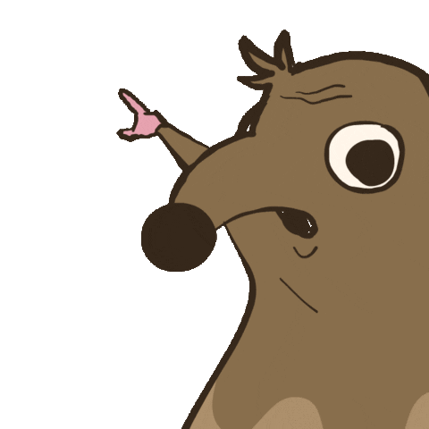

<!--end_slide-->

Advanced and Experimental (But still very usable)
---

## 3D Telemetry

- **Custom 3D engine (Very minimal)**: Visualizes IMU spatial rotations natively, with almost 0 lag (`pitch`, `yaw`, `roll`).
- Powered by `ratatui_wireframe`
- Fast braille 3D model rendering (Default).
- 3D model (`.obj`) rendering (Using the `ratty` terminal emulator and `ratatui_ratty` crate).


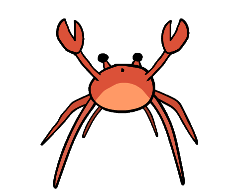

<!--end_slide-->

Ratatui-Wireframe crate
---

## Features 

- **Zero-dependency braille 3D**: Pure math projecting to braille characters.
- **Dynamic Orientation**: Real-time pitch, yaw and roll integration.
- **Built-in models**: Cube, Tetrahedron and Octahedron.
- **Custom loading**: Uses a custom `.wrfm` format. (Very similar to `.obj`)
- **Renders 3D models**: via `ratty` terminal and `.obj` files.


## Code Example

```rust +line_numbers
use ratatui_wireframe::{WireframeWidget, model::Model};
use ratatui::style::Color;

let my_model = Model::cube();

let wireframe = WireframeWidget::new(pitch, yaw, roll)
    .title("3D telemetry")
    .color(Color::Cyan)
    .model(my_model);

f.render_widget(wireframe, layout);
```

<!--end_slide-->

Wrfm File format
---

This is a custom file format defined to render braille 3D wireframes in the terminal using `ratatui_wireframe` crate. 

## Example `wrfm` file 

```obj +line_numbers
v 0 1 0     # Vertices
v -1 0 0
v 1 0 0
e 0 1       # Edges
e 0 2
```

## Implementation using `ratatui_wireframe`

```rust +line_numbers
let model = Model::from_wrfm(file);
let wf = WireframeWidget::new(p, y, r)
    .title("Custom 3D braille model")
    .color(Color::Green)
    .model(model);

f.render_widget(wf, layout);
```

<!--end_slide-->
<!--jump_to_middle-->

Live Demo
---

<!--end_slide-->

Links and Mentions
---

## Links

1. **Repository**:                https://github.com/Vaishnav-Sabari-Girish/ComChan
2. **Wiki**:                      https://github.com/Vaishnav-Sabari-Girish/ComChan/wiki
3. **Blog Post**:                 https://blog.vaishnavs.is-a.dev/comchan
4. **Ratty Terminal Emulator**:   https://github.com/orhun/ratty

<!--new_lines: 2--> 

## Mentions 

1. [Orhun Parmaksiz](https://github.com/orhun): Current maintainer of `ratatui` and developer of the `ratty` terminal emulator.

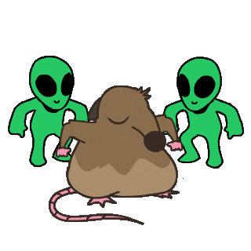

<!--end_slide-->

ComChan in the Wild
---

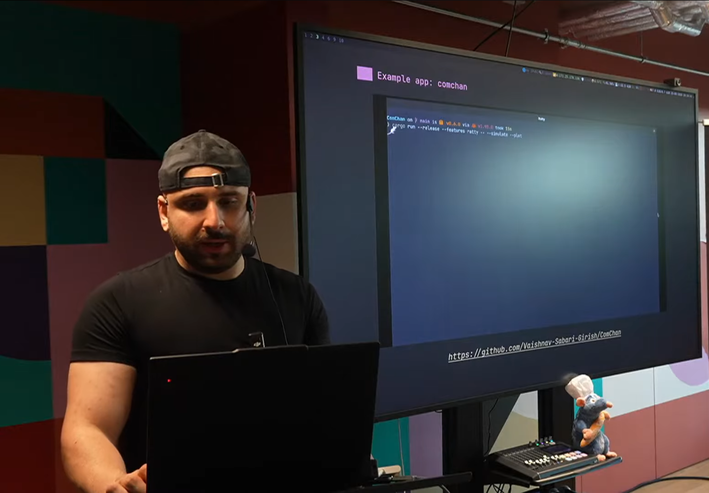

<!--alignment: center-->

https://www.youtube.com/watch?v=SGR5qBdwk30

<!--end_slide-->

Questions ?
---

<!--alignment: center-->
Thank you for coming to the talk !


